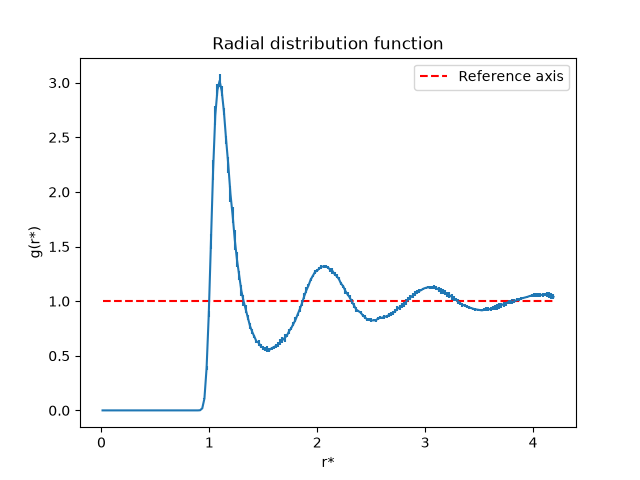
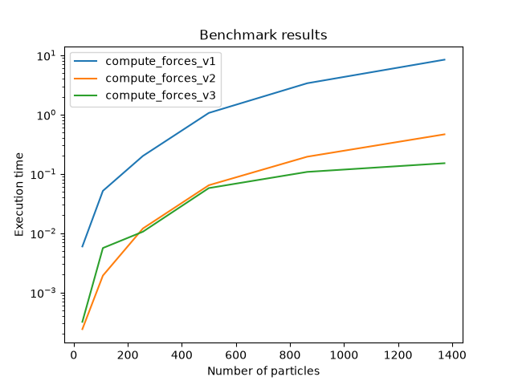
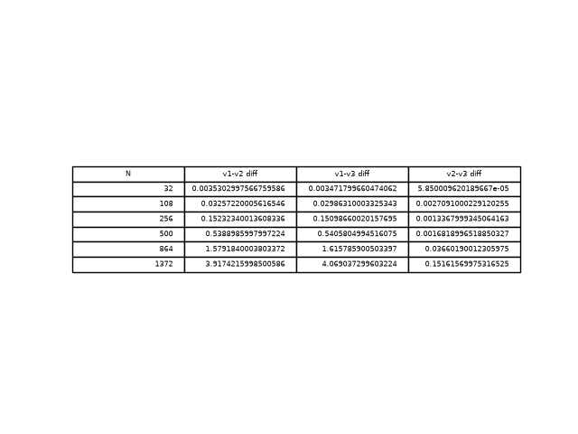

# LJ-md-simulation
Molecular dynamics simulation using the Lennard-Jones potential, with RDF validation against literature data
## Physics background
Lennard-Jones potential energy:

$$U(r)=4\epsilon \left[\left(\frac{\sigma}{r}\right)^{12}-\left(\frac{\sigma}{r}\right)^6\right]$$

LJ potential models atomic interactions: $r^{-12}$ term (Pauli repulsion) + $r^{-6}$ term (van der Waals attraction). Simulation runs in reduced units ($\sigma=\epsilon=1$)

Force equation:

$$F(r)=\frac{24\epsilon}{r}\left[2\left(\frac{\sigma}{r}\right)^{12}-\left(\frac{\sigma}{r}\right)^6\right]$$

Full derivation: [fundamentals.2_particle_test.ipynb](notebooks/fundamentals.2_particle_test.ipynb)
## Results
Radial distribution function of a Lennard-Jones fluid was validated near the triple point ($\rho*=0.844$, $T*=0.71$, $N=500$).

The obtained plot qualitatively matches the ones in Frenkel and Smit's textbook, and Rahman's paper. The first RDF peak has a value $g(r^*)=3.00\pm 0.06$, $r^*=1.10$. Because Rahman's paper and Frenkel and Smit's textbook compute their respective plots using slightly different parameters, the comparison between obtained values and literature values, in this case, is unfair. Nevertheles, since the obtained values are in the ballpark of the literature ones and as all of the parameters are considered to be in the triple point region, it can be concluded that the obtained $g(r^*)$ is correct. The obtained diffusion constant ($D^*$) is also within the comparable order of magnitude of the one that is obtained in Rahman's paper. After numerous runs the obtained value is $D^*=0.021\pm 0.004$. 
## Method
| Parameter | Value |
|---|---|
| N | $500$ |
| $T^*$ | $0.71$ |
| $\rho^*$ | $0.844$ |
| $r_c$ | $2.5$ |
| $\Delta t^*$ | $0.0001$ |
| $L^*$ | $8.40$ |
| Steps | $50000$ |

The force calculation method has three versions. Version 1 calculates forces for each pair of particles using nested loops. Version 2 performs the same calculation but vectorized — computing all pairwise distances and forces at once using NumPy array operations instead of looping. Version 3 divides the system into cells and only calculates forces between particles in the same or neighboring cells, avoiding unnecessary distance checks between far-apart particles.

 

Version 3 is fastest at 500 particles, with version 2 a close second. At smaller particle counts, version 2 becomes the faster method.
## References
1. Rahman, A. Correlations in the Motion of Atoms in Liquid Argon. Phys. Rev. 1964, 136 (2A), A405–A411.
2. Frenkel, D.; Smit, B. Understanding Molecular Simulation: From Algorithms to Applications, 2nd ed.; Academic Press: San Diego, 2002.